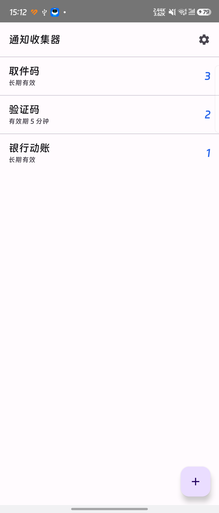
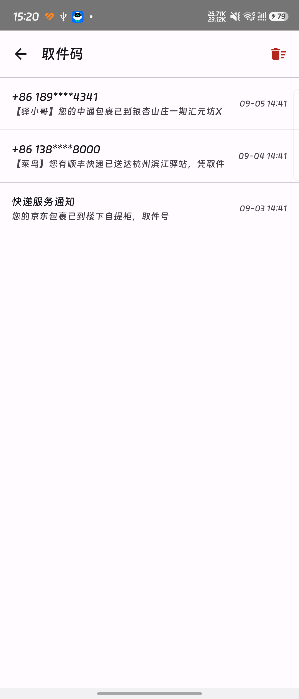
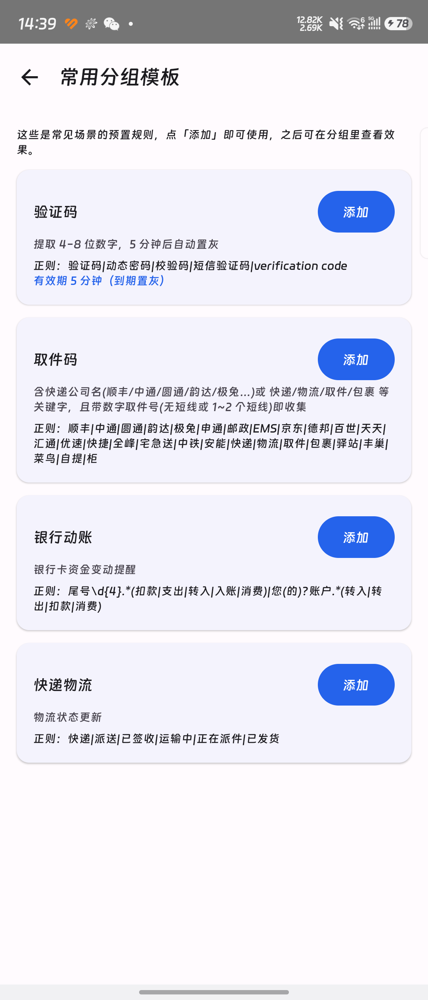
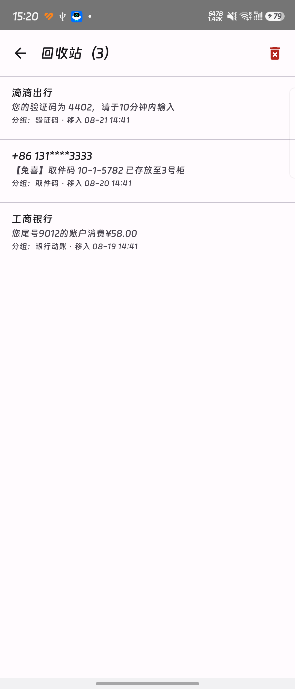
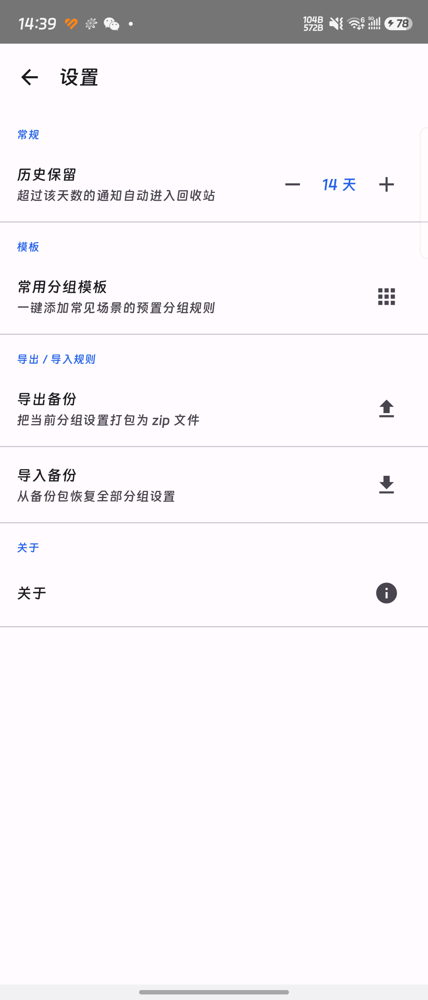

# 通知收集器（NotifyCollector）

一款只读、离线、完全本地的 Android 通知收集 App。它不像传统「免打扰」工具那样屏蔽通知，而是把所有收到的通知按你自定义的规则**归类收纳**到一个统一的「收件箱」里——验证码、取件码、银行动账、物流更新、快递柜……一目了然，找消息不用再去翻每个 App。

## 它能做什么

- **通知分组收件箱**：按关键字或正则匹配通知标题/正文，自动归入对应分组（如「验证码」「取件码」）。一个 App = 一个分组收件箱，所有信息集中可查。
- **验证码 / 取件码智能提取**：内置正则在通知正文里定位 4–8 位验证码、带短线的取件号（如 `15-2-2679`、`30-63583`），并按「关键语义前后置护栏」避开误抓（年份、手机号、门牌号不会被误识别）。
- **同日同取件码去重**：同一取件号当天被短信、App、微信三方重复推送时，只入库一条，避免列表被刷屏。
- **常用分组模板**：内置「验证码 5 分钟自动置灰」「取件码（含顺丰/中通/京东/极兔等十余家物流关键词）」「银行动账」「快递物流」4 个预置规则，一键添加即可用。
- **分组有效期**：可给分组设过期分钟数（如「验证码 5 分钟」），过期后自动置灰、提醒你这条已经过期。
- **左滑手势**：左滑通知条出现微信式大色块菜单——「已读/恢复」（蓝）、「删除」（红），菜单占行 1/3 宽、内容区保留 2/3。
- **拖拽排序**：首页长按任意分组进入编辑模式，整列上下摆动，按住右侧横杠拖动排序，点保存生效。
- **回收站**：超过 N 天（默认 14 天，可在设置里改）的通知自动移入回收站，左滑「恢复」或「删除」，防爆仓。
- **设置 & 备份**：历史保留天数可调；当前分组设置可导出为 zip 备份，也可从备份包恢复（适合换机或重装）。
- **关于**：版本、开发者信息一目了然。

## 隐私 / 安全

- **完全离线、无网络权限**：App 不申请 INTERNET 权限，所有数据只存在本机 SQLite，不上传任何服务器。
- **只读监听**：通过 Android 系统的「通知使用权」（NotificationListenerService）只读接收通知，不拦截、不删除原始通知，第三方 App 行为不受影响。
- **声明 `QUERY_ALL_PACKAGES`**：因为要匹配任意 App 的通知文本（不仅是你手填的几个）。这是 Android 11+ 的硬性要求，意味着不能上架 Google Play；本 App 定位就是自用 / 小范围侧载。

## 截图

| 首页 | 分组详情 |
| --- | --- |
|  |  |

| 模板 | 回收站 | 设置 |
| --- | --- | --- |
|  |  |  |

## 安装

> 仅适用于 Android 7.0+。由于本 App 声明 `QUERY_ALL_PACKAGES`，**无法上架 Google Play**，请手动侧载。

1. 手机开启「未知来源安装」或对应品牌的「安装外部来源应用」权限。
2. 从本仓库 Releases 页（<https://github.com/wq198155/NotifyCollector/releases>）下载 `NotifyCollector-1.0.apk` 传到手机。
3. 点击 APK 完成安装。
4. 首次打开 App，按引导进入系统「通知使用权」页面，开启「通知收集器」的权限。
5. 在「设置 → 模板」里一键添加预置分组（如「验证码」「取件码」），或在首页点右下「+」新建分组。

## 文件信息

- 下载：<https://github.com/wq198155/NotifyCollector/releases> 获取 `NotifyCollector-1.0.apk`（已签名，可直接侧载）
- 大小：约 11.3 MB（含钉钉进步体字体 2.1 MB）
- SHA-256：`d08f3de63f1daee3c4ffc3ccc7a4d931b5d38103f05db7205031d58866ed3d89`
- 签名：用 Android 调试密钥签名（仅供自用 / 侧载宣传，未上架）。如需正式分发请自行配置 release 签名。
- 字体：全 App 统一使用「钉钉进步体」（单一字重 Regular）
- 最低系统：Android 7.0（API 24）
- 目标系统：Android 14（API 34）

## 技术栈（自用 / 二开参考）

- Kotlin + Jetpack Compose + Material 3
- Room（SQLite，WAL）+ NotificationListenerService（只读监听）
- 单 Activity + Navigation Compose 路由
- 无任何第三方网络库 / 分析 SDK / 推送 SDK

> 想自己改、自己构建？见 [docs/DEVELOPMENT.md](docs/DEVELOPMENT.md)。

## 版本

- v1.0
- 开发者：smartWQ

---

> 自用作品，欢迎基于此项目思路自部署、自修改、自推广。如果觉得好用，欢迎转发给同样被验证码/取件码分散到 N 个 App 里折磨的朋友。
